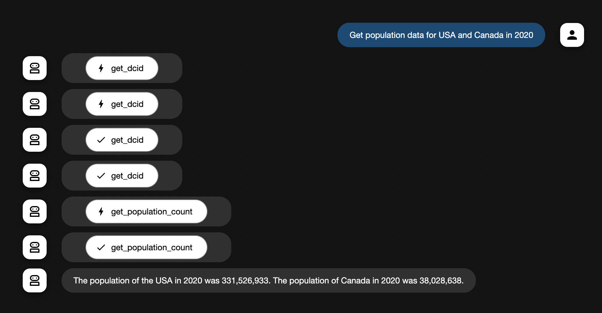

# Data Commons ADK Agent

A simple AI agent that leverages the [Data Commons](https://datacommons.org/) API, [Google ADK](https://github.com/google/agents-sdk) and Gemini 2.0 Flash to provide statistical information about places around the world.

## Overview

This agent is built on Google's ADK (Agent Development Kit) and allows users to easily access demographic and statistical data from Data Commons through simple natural language queries. The agent can:

1. **Find place DCIDs** - Convert natural place names (like "California" or "New York City") to Data Commons DCIDs
2. **Discover available statistics** - List the statistical variables available for a specific place
3. **Retrieve population data** - Get population counts for places with optional date filtering

## Example Screenshot



## Setup and Installation

### Prerequisites

- Python 3.8 or higher
- Google AI API key, see https://aistudio.google.com/apikey
- Data Commons API key, see https://docs.datacommons.org/api/rest/v2/#authentication

### Installation

1. Clone this repository:
   ```
   git clone https://github.com/mgarciaferreiro/datcom-adk.git
   cd datcom-adk
   ```

2. We recommend creating a virtual Python environment using venv:
   ```
   python -m venv .venv
   ```
   Now, you can activate the virtual environment using the appropriate command for your operating system and environment:
   ```
   # Mac / Linux
    source .venv/bin/activate

    # Windows CMD:
    .venv\Scripts\activate.bat

    # Windows PowerShell:
    .venv\Scripts\Activate.ps1
    ```

3. Install the required packages:
   ```
   pip install google-adk
   ```

4. Create a `.env` file in the `datcom_agent` directory with your API keys:
   ```
   GOOGLE_GENAI_USE_VERTEXAI=FALSE
   GOOGLE_API_KEY=your_google_api_key
   DATCOM_API_KEY=your_datcom_api_key
   ```

## Usage

Run the following command to launch the dev UI and open the url provided:

```
adk web
```

### Example Queries

- "What's the DCID for New York City?"
- "Show me available variables for California"
- "What's the population of Texas"
- "Get population data for USA and Canada in 2020"

## How It Works

The agent uses three main functions to interact with the Data Commons API:

1. `get_dcid()` - Resolves place names to their Data Commons identifiers (DCIDs)
2. `get_available_variables()` - Retrieves up to 10 statistical variables available for one or more places
3. `get_population_count()` - Gets population statistics for one or more places, with optional date filtering

## Next Steps

Here are some ideas for future development:

1. **Support for more statistical variables** - Extend beyond population counts to include other variables like median income, unemployment rates, etc.

2. **Time series data retrieval** - Add functionality to get data over time periods rather than single dates

3. **Comparative analysis** - Enable comparing statistics between multiple places

4. **Data visualization** - Integrate charts and graphs to visualize the retrieved data

5. **Caching mechanism** - Implement caching to improve performance for repeated queries

6. **Interactive dashboard** - Create a web interface for interacting with the agent
